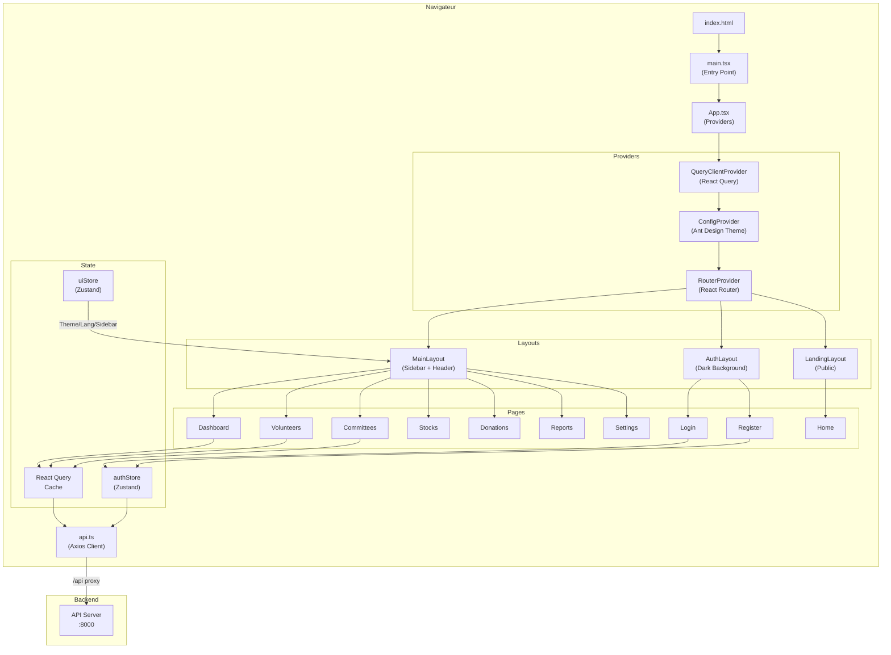

# 📐 Nexus-AID — Documentation Architecture Frontend

> **Système Intégré de Gestion, Secourisme et Coordination Assisté par IA**
> pour le **Croissant Rouge Tunisien**

---

## 📋 Table des matières

1. [Vue d'ensemble](#1--vue-densemble)
2. [Stack Technique](#2--stack-technique)
3. [Versions des dépendances](#3--versions-des-dépendances)
4. [Architecture du projet](#4--architecture-du-projet)
5. [Décomposition des fichiers](#5--décomposition-des-fichiers)
6. [Système de routage](#6--système-de-routage)
7. [Gestion d'état (State Management)](#7--gestion-détat-state-management)
8. [Service API (HTTP Client)](#8--service-api-http-client)
9. [Internationalisation (i18n)](#9--internationalisation-i18n)
10. [Thème et Design System](#10--thème-et-design-system)
11. [Système de types (TypeScript)](#11--système-de-types-typescript)
12. [Configuration Build & Dev](#12--configuration-build--dev)
13. [Variables d'environnement](#13--variables-denvironnement)
14. [Diagramme d'architecture](#14--diagramme-darchitecture)

---

## 1. 🔭 Vue d'ensemble

**Nexus-AID** est une application web frontend monopage (SPA) développée pour le Croissant Rouge Tunisien. Elle offre des modules de gestion des volontaires, comités, stocks, dons, rapports, ainsi qu'un module IA pour l'assistance au secourisme (CPR).

| Propriété            | Valeur                                    |
|----------------------|-------------------------------------------|
| **Nom du projet**    | `frontend`                                |
| **Version**          | `0.0.0` (en développement)                |
| **Type de module**   | ESM (`"type": "module"`)                  |
| **Langage**          | TypeScript (strict mode)                  |
| **Framework UI**     | React 19 + Ant Design 5                   |
| **Bundler**          | Vite 7                                    |
| **CSS**              | TailwindCSS 4                             |
| **Port dev**         | `3000`                                    |
| **Proxy API**        | `/api` → `http://localhost:8000`          |

---

## 2. 🛠 Stack Technique

### Framework & Langage
- **React 19** — Bibliothèque UI avec les dernières fonctionnalités (concurrent features)
- **TypeScript 5.9** — Typage statique strict pour la fiabilité du code
- **Vite 7** — Bundler ultra-rapide avec HMR instantané

### UI & Styling
- **Ant Design 5** (`antd`) — Composants UI enterprise-grade
- **Ant Design Icons** — Bibliothèque d'icônes intégrée
- **Ant Design Pro Components** — Composants avancés (tableaux, formulaires pro)
- **Ant Design Charts** — Graphiques et visualisations
- **TailwindCSS 4** — Framework CSS utility-first
- **Framer Motion** — Animations et transitions fluides
- **Google Fonts** — Playfair Display, DM Sans, Space Mono, Inter

### State Management & Data Fetching
- **Zustand 5** — Gestion d'état légère et performante
- **TanStack React Query 5** — Cache serveur, requêtes asynchrones, mutations

### Routing
- **React Router DOM 7** — Routage côté client avec lazy loading

### Internationalisation
- **i18next 25** + **react-i18next 16** — Support multilingue (FR, AR, EN)

### HTTP Client
- **Axios** — Client HTTP avec intercepteurs pour JWT

### Utilitaires
- **Day.js** — Manipulation de dates (léger, API Moment-compatible)

### Qualité du code
- **ESLint 9** — Linting avec plugins React Hooks et React Refresh
- **TypeScript ESLint** — Règles ESLint typées

---

## 3. 📦 Versions des dépendances

### Dépendances de production

| Package                         | Version     | Rôle                                       |
|---------------------------------|-------------|---------------------------------------------|
| `react`                         | `^19.2.0`   | Bibliothèque UI principale                  |
| `react-dom`                     | `^19.2.0`   | Rendu DOM React                             |
| `react-router-dom`              | `^7.13.1`   | Routage SPA                                 |
| `antd`                          | `^5.29.3`   | Composants UI (Ant Design)                  |
| `@ant-design/icons`             | `^6.1.0`    | Icônes Ant Design                           |
| `@ant-design/pro-components`    | `^2.8.10`   | Composants Pro (tableaux avancés, etc.)      |
| `@ant-design/charts`            | `^2.6.7`    | Graphiques et diagrammes                    |
| `@tanstack/react-query`         | `^5.90.21`  | Data fetching, cache, mutations             |
| `zustand`                       | `^5.0.11`   | Gestion d'état global                       |
| `axios`                         | `^1.13.5`   | Client HTTP avec intercepteurs              |
| `i18next`                       | `^25.8.13`  | Moteur d'internationalisation               |
| `react-i18next`                 | `^16.5.4`   | Binding React pour i18next                  |
| `framer-motion`                 | `^12.34.3`  | Animations et transitions                   |
| `dayjs`                         | `^1.11.19`  | Manipulation de dates                       |

### Dépendances de développement

| Package                         | Version     | Rôle                                       |
|---------------------------------|-------------|---------------------------------------------|
| `vite`                          | `^7.3.1`    | Bundler et serveur de développement         |
| `@vitejs/plugin-react`          | `^5.1.1`    | Plugin Vite pour React (Fast Refresh)       |
| `typescript`                    | `~5.9.3`    | Compilateur TypeScript                      |
| `tailwindcss`                   | `^4.2.1`    | Framework CSS utility-first                 |
| `@tailwindcss/vite`             | `^4.2.1`    | Plugin Vite pour TailwindCSS               |
| `@types/node`                   | `^24.10.1`  | Types Node.js                               |
| `@types/react`                  | `^19.2.7`   | Types React                                 |
| `@types/react-dom`              | `^19.2.3`   | Types React DOM                             |
| `eslint`                        | `^9.39.1`   | Linter JavaScript/TypeScript               |
| `@eslint/js`                    | `^9.39.1`   | Config ESLint de base                       |
| `typescript-eslint`             | `^8.48.0`   | Plugin ESLint pour TypeScript              |
| `eslint-plugin-react-hooks`     | `^7.0.1`    | Règles ESLint pour React Hooks             |
| `eslint-plugin-react-refresh`   | `^0.4.24`   | Règles ESLint pour React Refresh           |
| `globals`                       | `^16.5.0`   | Définitions de variables globales           |

---

## 4. 🏗 Architecture du projet

Le projet suit une architecture **feature-based** couplée à une organisation par couche technique :

```
┌──────────────────────────────────────────────────────────┐
│                      index.html                          │
│                     (Point d'entrée HTML)                │
├──────────────────────────────────────────────────────────┤
│                      main.tsx                            │
│              (Bootstrap : React + CSS + i18n)            │
├──────────────────────────────────────────────────────────┤
│                       App.tsx                            │
│   (Providers : QueryClient + ConfigProvider + Router)    │
├──────────────┬──────────────┬────────────────────────────┤
│   Layouts    │   Pages      │   Components               │
│  ┌─────────┐ │  ┌─────────┐ │  ┌──────────────────────┐  │
│  │ Main    │ │  │Dashboard│ │  │ auth/                │  │
│  │ Auth    │ │  │Volunteer│ │  │ common/              │  │
│  │ Landing │ │  │Committee│ │  │ landing/             │  │
│  └─────────┘ │  │ Stocks  │ │  └──────────────────────┘  │
│              │  │Donations│ │                            │
│              │  │ Reports │ │                            │
│              │  │Settings │ │                            │
│              │  │ Home    │ │                            │
│              │  │ Login   │ │                            │
│              │  │Register │ │                            │
│              │  │  404    │ │                            │
│              │  └─────────┘ │                            │
├──────────────┴──────────────┴────────────────────────────┤
│  stores/   │  services/  │  hooks/  │  utils/  │ types/  │
│  (Zustand) │  (Axios)    │ (Custom) │ (Helper) │ (TS)    │
├──────────────────────────────────────────────────────────┤
│                      config/                             │
│    routes.tsx │ theme.ts │ i18n.ts │ env.ts │ locales/   │
└──────────────────────────────────────────────────────────┘
```

---

## 5. 📂 Décomposition des fichiers

### Racine du projet

```
Frontend/
├── .env                        # Variables d'environnement (Vite)
├── .github/                    # Configuration GitHub (CI/CD, templates)
├── .gitignore                  # Fichiers ignorés par Git
├── .vscode/                    # Configuration VS Code
├── index.html                  # Point d'entrée HTML (SPA)
├── package.json                # Dépendances et scripts npm
├── package-lock.json           # Lockfile des dépendances
├── eslint.config.js            # Configuration ESLint (flat config)
├── tsconfig.json               # Config TS racine (références)
├── tsconfig.app.json           # Config TS pour l'application
├── tsconfig.node.json          # Config TS pour Node/Vite
├── vite.config.ts              # Configuration Vite (plugins, alias, proxy)
├── dist/                       # Build de production (généré)
├── public/                     # Assets statiques publics
│   └── vite.svg                # Favicon
└── src/                        # Code source principal
```

### Source (`src/`)

```
src/
├── main.tsx                    # Point d'entrée React (createRoot + StrictMode)
├── App.tsx                     # Composant racine (Providers globaux)
├── index.css                   # Styles globaux + TailwindCSS
│
├── assets/                     # Ressources statiques
│   └── react.svg               # Logo React SVG
│
├── config/                     # Configuration centralisée
│   ├── env.ts                  # Variables d'environnement typées
│   ├── i18n.ts                 # Configuration i18next (FR/AR/EN)
│   ├── routes.tsx              # Définition du routeur (lazy loading)
│   ├── theme.ts                # Thèmes Ant Design (light/dark)
│   └── locales/                # Fichiers de traduction
│       ├── fr.json             # Français (langue par défaut)
│       ├── en.json             # Anglais
│       └── ar.json             # Arabe
│
├── layouts/                    # Layouts de mise en page
│   ├── MainLayout.tsx          # Layout principal (sidebar + header + content)
│   ├── AuthLayout.tsx          # Layout d'authentification (dark background)
│   └── LandingLayout.tsx       # Layout page d'accueil publique
│
├── pages/                      # Pages / vues de l'application
│   ├── NotFoundPage.tsx        # Page 404
│   ├── auth/                   # Pages d'authentification
│   │   ├── LoginPage.tsx       #   → Connexion
│   │   └── RegisterPage.tsx    #   → Inscription
│   ├── home/                   # Page d'accueil publique
│   │   └── HomePage.tsx        #   → Landing page
│   ├── dashboard/              # Tableau de bord
│   │   └── DashboardPage.tsx   #   → Dashboard principal
│   ├── volunteers/             # Gestion des volontaires
│   │   └── VolunteersPage.tsx  #   → Liste/gestion volontaires
│   ├── committees/             # Gestion des comités
│   │   └── CommitteesPage.tsx  #   → Hiérarchie des comités
│   ├── stocks/                 # Gestion des stocks
│   │   └── StocksPage.tsx      #   → Inventaire du matériel
│   ├── donations/              # Gestion des dons
│   │   └── DonationsPage.tsx   #   → Suivi des donations
│   ├── reports/                # Rapports
│   │   └── ReportsPage.tsx     #   → SITREP, DREF, financiers
│   └── settings/               # Paramètres
│       └── SettingsPage.tsx    #   → Configuration utilisateur
│
├── components/                 # Composants réutilisables
│   ├── auth/                   # Composants liés à l'authentification
│   │   ├── AuthVisual.tsx      #   → Visuel décoratif des pages auth
│   │   └── PasswordStrength.tsx#   → Indicateur de force du mot de passe
│   ├── common/                 # Composants partagés (UI commune)
│   │   ├── BackgroundMesh.tsx  #   → Arrière-plan animé mesh gradient
│   │   ├── Logo.tsx            #   → Logo Nexus-AID
│   │   └── ThemeToggle.tsx     #   → Bouton bascule thème clair/sombre
│   └── landing/                # Composants de la page d'accueil
│       ├── Navbar.tsx          #   → Barre de navigation
│       ├── HeroSection.tsx     #   → Section héro principale
│       ├── StatsBand.tsx       #   → Bandeau de statistiques
│       ├── ModulesSection.tsx  #   → Présentation des modules
│       ├── NewsSection.tsx     #   → Actualités
│       ├── ContactSection.tsx  #   → Formulaire de contact
│       └── Footer.tsx          #   → Pied de page
│
├── services/                   # Services / couche API
│   └── api.ts                  # Client Axios configuré (intercepteurs JWT)
│
├── stores/                     # Stores Zustand (état global)
│   ├── index.ts                # Barrel export des stores
│   ├── authStore.ts            # Store d'authentification (login, logout, JWT)
│   └── uiStore.ts              # Store UI (sidebar, thème, langue)
│
├── types/                      # Définitions de types TypeScript
│   └── index.ts                # Types : User, Committee, Stock, Donation, etc.
│
├── hooks/                      # Hooks React personnalisés
│   └── index.ts                # Barrel export (vide, extensible)
│
└── utils/                      # Fonctions utilitaires
    └── index.ts                # formatCurrency, formatDate, getInitials, etc.
```

---

## 6. 🗺 Système de routage

Le routage utilise **React Router DOM v7** avec un `createBrowserRouter` et du **lazy loading** pour le code splitting.

### Structure des routes

| Chemin           | Layout          | Page               | Description                          |
|------------------|-----------------|---------------------|--------------------------------------|
| `/`              | `MainLayout`    | → Redirect          | Redirige vers `/dashboard`           |
| `/dashboard`     | `MainLayout`    | `DashboardPage`     | Tableau de bord principal            |
| `/volunteers`    | `MainLayout`    | `VolunteersPage`    | Gestion des volontaires              |
| `/committees`    | `MainLayout`    | `CommitteesPage`    | Gestion des comités                  |
| `/stocks`        | `MainLayout`    | `StocksPage`        | Gestion des stocks                   |
| `/donations`     | `MainLayout`    | `DonationsPage`     | Gestion des dons                     |
| `/reports`       | `MainLayout`    | `ReportsPage`       | Rapports (SITREP, DREF, etc.)        |
| `/settings`      | `MainLayout`    | `SettingsPage`      | Paramètres utilisateur               |
| `/landing`       | `LandingLayout` | `HomePage`          | Page d'accueil publique              |
| `/login`         | `AuthLayout`    | `LoginPage`         | Connexion                            |
| `/register`      | `AuthLayout`    | `RegisterPage`      | Inscription                          |
| `*`              | —               | `NotFoundPage`      | Page 404                             |

### Fonctionnalités du routage
- **Lazy Loading** : Toutes les pages sont chargées dynamiquement via `React.lazy()`
- **Suspense Fallback** : Écran de chargement animé avec spinner (brand Nexus-AID)
- **Code Splitting** : Chunks séparés via Vite (`vendor-react`, `vendor-antd`, `vendor-query`, `vendor-utils`)

---

## 7. 🧠 Gestion d'état (State Management)

### Architecture : Zustand avec Persistence

Deux stores principaux avec le middleware `persist` (localStorage) :

#### `authStore.ts` — Authentification
| Propriété         | Type                   | Description                        |
|-------------------|------------------------|------------------------------------|
| `user`            | `User \| null`         | Utilisateur connecté               |
| `isAuthenticated` | `boolean`              | Statut d'authentification          |
| `isLoading`       | `boolean`              | Chargement en cours                |
| `login()`         | `(credentials) => void`| Connexion via API                  |
| `logout()`        | `() => void`           | Déconnexion + nettoyage tokens     |
| `setUser()`       | `(user) => void`       | Mise à jour de l'utilisateur       |
| `checkAuth()`     | `() => void`           | Vérification du token (GET /auth/me)|

#### `uiStore.ts` — Interface utilisateur
| Propriété           | Type                           | Description                  |
|---------------------|--------------------------------|------------------------------|
| `sidebarCollapsed`  | `boolean`                      | État de la sidebar           |
| `toggleSidebar()`   | `() => void`                   | Basculer la sidebar          |
| `themeMode`         | `'light' \| 'dark'`            | Mode du thème                |
| `toggleTheme()`     | `() => void`                   | Basculer clair/sombre        |
| `language`          | `'fr' \| 'ar' \| 'en'`        | Langue active                |
| `setLanguage()`     | `(lang) => void`               | Changer de langue            |

### React Query — Cache serveur

Configuration dans `App.tsx` :
- **Retry** : 2 tentatives pour les queries, 1 pour les mutations
- **Stale Time** : 5 minutes
- **GC Time** : 10 minutes
- **Refetch on Focus** : Désactivé

---

## 8. 🌐 Service API (HTTP Client)

### `services/api.ts` — Client Axios centralisé

```
┌─────────────┐     ┌─────────────────┐     ┌──────────────┐
│   Frontend  │────▶│   Vite Proxy    │────▶│   Backend    │
│   (Axios)   │     │  /api → :8000   │     │  :8000       │
└─────────────┘     └─────────────────┘     └──────────────┘
```

#### Intercepteur de requête
- Attache automatiquement le token JWT (`Bearer`) depuis `localStorage`

#### Intercepteur de réponse
- **401 Unauthorized** : Tente un rafraîchissement du token via `/auth/refresh`
- En cas d'échec du refresh : nettoyage des tokens + redirection vers `/login`

#### Configuration
| Paramètre     | Valeur               |
|----------------|----------------------|
| Base URL       | `/api` (par défaut)  |
| Timeout        | 15 000 ms            |
| Content-Type   | `application/json`   |

---

## 9. 🌍 Internationalisation (i18n)

### Configuration i18next

| Paramètre         | Valeur          |
|--------------------|-----------------|
| Langue par défaut  | `fr` (Français) |
| Langue de repli    | `fr`            |
| Langues supportées | FR, AR, EN      |
| Escape Values      | `false` (React) |

### Fichiers de traduction

```
config/locales/
├── fr.json     # 🇫🇷 Français (1 718 octets)
├── en.json     # 🇬🇧 Anglais  (1 622 octets)
└── ar.json     # 🇸🇦 Arabe    (2 086 octets) — support RTL
```

L'application détecte et applique la direction `dir="ltr"` / `dir="rtl"` selon la langue sélectionnée. L'HTML racine est défini en `lang="fr"`.

---

## 10. 🎨 Thème et Design System

### Palette de marque CRT (Croissant Rouge Tunisien)

| Nom      | Hex       | Utilisation                     |
|----------|-----------|---------------------------------|
| Red      | `#f10316` | Couleur primaire, CTA           |
| Crimson  | `#e23a4d` | Couleur secondaire, liens       |
| Pink     | `#ef7984` | Hover, accents                  |
| Blush    | `#f7b6b9` | Fond subtil                     |
| Light    | `#f7f8f6` | Background layout (light mode)  |
| Dark     | `#302d28` | Texte principal, sidebar        |
| Gray     | `#bebdb9` | Texte secondaire (dark)         |
| Mid      | `#7a7774` | Texte secondaire (light)        |

### Modes supportés
- **Light Mode** : Fond blanc/crème, texte sombre
- **Dark Mode** : Fond `#141414`, sidebar `#0d0d14`

### Typographie
- **Primaire** : DM Sans (300-700)
- **Secondaire** : Inter (300-800)
- **Display** : Playfair Display (400, 700, 900)
- **Mono** : Space Mono (400, 700)

### Tokens de design (Ant Design Theme)
- **Border Radius** : 12px (défaut), 16px (large), 8px (small)
- **Padding** : 16px (défaut), 24px (large), 12px (small), 8px (extra-small)

---

## 11. 📝 Système de types (TypeScript)

### Types principaux définis dans `types/index.ts`

#### Authentification & Utilisateurs
| Type               | Description                                              |
|--------------------|----------------------------------------------------------|
| `Role`             | Union de 10 rôles : `admin`, `president_national`, etc.  |
| `User`             | Utilisateur avec profil, rôle, certifications            |
| `Certification`    | Certifications de secourisme                             |
| `AuthTokens`       | Paire access/refresh token + expiration                  |
| `LoginCredentials` | Email + mot de passe                                     |

#### Organisation
| Type               | Description                                              |
|--------------------|----------------------------------------------------------|
| `CommitteeLevel`   | `national`, `regional`, `local`, `club_universitaire`    |
| `Committee`        | Comité avec hiérarchie parent/enfants                    |

#### Modules métier
| Type               | Description                                              |
|--------------------|----------------------------------------------------------|
| `StockItem`        | Article en stock avec seuils et expiration                |
| `StockAlert`       | Alerte stock bas / expiré                                |
| `Donation`         | Don monétaire ou matériel avec statut                    |
| `Report`           | Rapport SITREP / DREF / activité / financier             |
| `Alert`            | Alerte catastrophe avec géolocalisation                  |

#### Module IA / Secourisme
| Type               | Description                                              |
|--------------------|----------------------------------------------------------|
| `CPRSession`       | Session CPR avec scores et taux de compression           |
| `CPRFeedback`      | Feedback temps réel sur la qualité du CPR                |

#### Types utilitaires
| Type                  | Description                                           |
|-----------------------|-------------------------------------------------------|
| `PaginatedResponse<T>`| Réponse paginée générique                             |
| `ApiError`            | Erreur API avec code, message, détails                |
| `SelectOption`        | Option pour les sélecteurs (label/value)              |
| `TableParams`         | Paramètres de tableau (pagination, tri, filtres)      |

---

## 12. ⚙️ Configuration Build & Dev

### Scripts npm

| Script       | Commande                    | Description                          |
|-------------|------------------------------|--------------------------------------|
| `dev`       | `vite`                       | Serveur de développement (port 3000) |
| `build`     | `tsc -b && vite build`       | Vérification TS + build production   |
| `lint`      | `eslint .`                   | Analyse statique du code             |
| `preview`   | `vite preview`               | Prévisualisation du build            |

### Alias de chemins

Les alias simplifient les imports et évitent les chemins relatifs :

| Alias          | Chemin résolu       |
|----------------|--------------------|
| `@/*`          | `src/*`            |
| `@components/*`| `src/components/*` |
| `@pages/*`     | `src/pages/*`      |
| `@hooks/*`     | `src/hooks/*`      |
| `@services/*`  | `src/services/*`   |
| `@stores/*`    | `src/stores/*`     |
| `@utils/*`     | `src/utils/*`      |
| `@types/*`     | `src/types/*`      |
| `@assets/*`    | `src/assets/*`     |
| `@layouts/*`   | `src/layouts/*`    |
| `@config/*`    | `src/config/*`     |

### Optimisation du build (Code Splitting)

Vite découpe automatiquement les chunks vendeur pour un meilleur caching :

| Chunk            | Librairies incluses                        |
|------------------|--------------------------------------------|
| `vendor-react`   | `react`, `react-dom`, `react-router-dom`   |
| `vendor-antd`    | `antd`, `@ant-design/icons`                |
| `vendor-query`   | `@tanstack/react-query`                    |
| `vendor-utils`   | `axios`, `dayjs`, `zustand`, `i18next`     |

### TypeScript Configuration
- **Target** : ES2022
- **Module** : ESNext
- **Module Resolution** : Bundler
- **Strict Mode** : ✅ Activé
- **No Unused Locals** : ✅ Activé
- **No Unused Parameters** : ✅ Activé
- **JSX** : `react-jsx`

---

## 13. 🔐 Variables d'environnement

Toutes les variables sont préfixées `VITE_` pour l'exposition côté client :

| Variable                 | Valeur par défaut | Description                        |
|--------------------------|-------------------|------------------------------------|
| `VITE_API_BASE_URL`     | `/api`            | URL de base de l'API backend       |
| `VITE_API_TIMEOUT`      | `15000`           | Timeout des requêtes (ms)          |
| `VITE_APP_VERSION`      | `1.0.0`           | Version de l'application           |
| `VITE_DEFAULT_LANGUAGE` | `fr`              | Langue par défaut                  |
| `VITE_ENABLE_AI`        | `true`            | Activer le module IA/CPR           |
| `VITE_ENABLE_OFFLINE`   | `true`            | Activer le mode hors ligne         |

---

## 14. 📊 Diagramme d'architecture



---

## 📄 Fonctions utilitaires (`utils/index.ts`)

| Fonction          | Signature                                             | Description                              |
|-------------------|-------------------------------------------------------|------------------------------------------|
| `formatCurrency`  | `(amount: number, currency?: string) => string`       | Formate un montant en TND               |
| `formatDate`      | `(date: string \| Date, options?) => string`          | Formate une date en français            |
| `getInitials`     | `(name: string) => string`                            | Extrait les initiales (max 2 caractères)|
| `truncate`        | `(text: string, maxLength: number) => string`         | Tronque avec ellipsis                   |
| `getRoleLabel`    | `(role: string) => string`                            | Libellé français du rôle utilisateur    |

---

> **Dernière mise à jour** : 26 février 2026
> **Généré automatiquement** à partir de l'analyse du code source Nexus-AID Frontend
