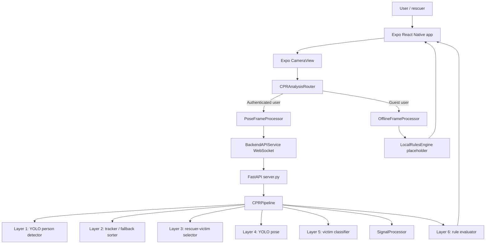
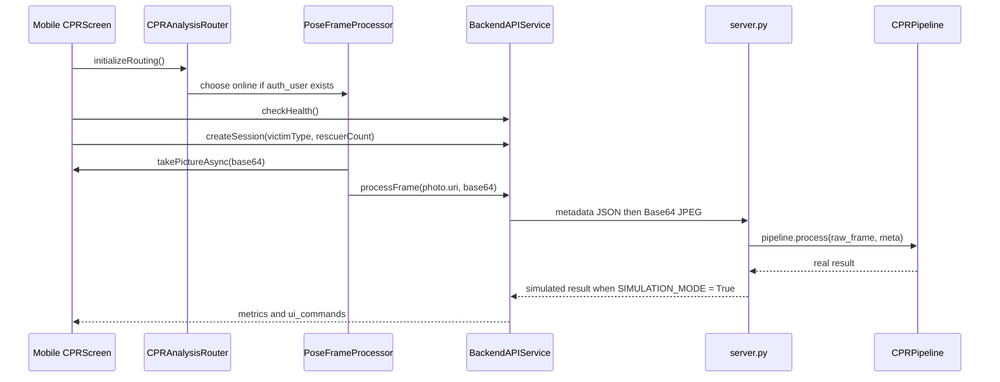
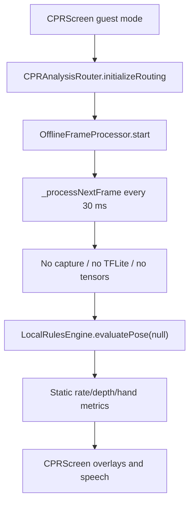

# Nexus-AID CPR Mobile Application Technical Audit

Audit date: 2026-06-04  
Scope: `cpr_mobile_app`, `server.py`, `cpr_vision_system`, model assets, Docker/deployment files, local tests, and project documentation.  
Verdict: No-Go for production, especially for real emergency or regulated medical use. The codebase contains promising architecture pieces, but the active online path is simulation-enabled, the offline TFLite path is a placeholder, deployment stubs out the AI pipeline, and several use cases are not functionally supported.

## Executive Summary

The project is a React Native / Expo mobile application for CPR training and Croissant Rouge Tunisien volunteer workflows. It exposes two intended CPR analysis modes:

1. Online inference: mobile camera frames are sent to a Python FastAPI WebSocket server, which runs YOLO detection, tracking, pose estimation, victim classification, signal processing, and CPR rule evaluation.
2. Offline inference: the mobile app claims to run TFLite edge models locally.

The online backend has a real six-layer pipeline in source code, but `server.py` has `SIMULATION_MODE = True` at `server.py:33`, causing scripted feedback to override real inference output at `server.py:139`. The Docker image also replaces the vision system with a stub `CPRPipeline` returning `{'status': 'STUB'}` in `Dockerfile:16` and `Dockerfile:18`. The offline path does not load a TFLite model, does not preprocess real frames, does not run interpreter inference, and returns dummy local metrics from `OfflineFrameProcessor._processNextFrame()` at `cpr_mobile_app/src/services/offline/OfflineFrameProcessor.js:91` and `LocalRulesEngine.evaluatePose()` at `cpr_mobile_app/src/services/offline/LocalRulesEngine.js:18`.

The stated business objective is not currently met: the app cannot be trusted to determine CPR quality or victim type in production.

## System Overview

### Mobile Architecture

| Area | Implementation | Status |
|---|---|---|
| Navigation/auth | `cpr_mobile_app/src/App.js`, `AuthContext.js`, `AuthService.js` | Functional but uses mock fallback credentials |
| CPR screen | `cpr_mobile_app/src/screens/CPRScreen.js` | Main camera UI and feedback rendering |
| Online routing | `CPRAnalysisRouter.js` -> `PoseFrameProcessor.js` -> `BackendAPIService.js` | Implemented, but backend simulation and deployment conflicts block correctness |
| Offline routing | `CPRAnalysisRouter.js` -> `OfflineFrameProcessor.js` | Placeholder, not TFLite inference |
| Rules | `rcp_rules.json`, `RulesEngine.js`, `layer6_logic.py` | Useful rule data, but two separate evaluators exist |
| Chat assistant | `ChatBotService.js` | Keyword lookup, not a generative AI assistant |
| Alerts/weather/notifications | `MockDataService.js` | Mock-only flows |

### Backend Architecture

| Layer | File/function | Purpose | Status |
|---|---|---|---|
| WebSocket API | `server.py:cpr_session()` | Receives metadata plus Base64 JPEG | Implemented but unauthenticated and simulation-enabled |
| Detection | `layer1_detection.py:PersonDetector.detect()` | YOLO person detection | Real model source path |
| Tracking | `layer2_tracker.py:PersonTracker.update()` | ByteTrack or fallback sort order | Fallback not stable |
| Pair selection | `layer3_selector.py:PairSelector.select()` | Identify rescuer and victim | Requires at least 2 people |
| Pose | `layer4_pose.py:PoseEstimator.process()` | YOLO pose keypoints | Real model source path |
| Classification | `layer5_classifier.py:VictimClassifier.classify()` | Victim type classification | Real source path but no calibration evidence |
| Signal | `signal_processor.py:SignalProcessor.update()` | Compression events, BPM, depth proxy | Heuristic, not clinically calibrated |
| Rule evaluation | `layer6_logic.py:RuleEvaluator.evaluate()` | Converts metrics to UI commands | Partial rule coverage |

## Business and Requirements Analysis

### Project Purpose

The project aims to guide CPR training and volunteer emergency workflows for Croissant Rouge Tunisien users. It provides public emergency access, authenticated member dashboard modules, CPR camera analysis, first aid knowledge content, role-gated interventions, alert submission, profile, settings, weather, and calendar views.

### Target Users

| User group | Needs | Implemented support |
|---|---|---|
| Public visitor | Emergency call, CPR guest mode | Partially implemented |
| Volunteer/secouriste | Training, CPR guidance, chatbot, profile | Mostly UI/mock implemented |
| NDRT/RDRT/leadership | Notifications, interventions, alerts | Role-gated UI with mock data |
| Trainers/demo presenters | Simulated CPR feedback | Implemented strongly, but not clearly separated from production |

### Functional Requirements

| Requirement | Evidence | Audit result |
|---|---|---|
| Public CPR access without login | `WelcomeScreen.js:190`, `CPRScreen.js:75` | Routes to offline placeholder |
| Authenticated CPR analysis | `DashboardScreen.js:156`, `CPRScreen.js:159` | Routes to backend but simulation overrides output |
| Real-time visual feedback | `CPRScreen.js:392`, `CPRScreen.js:404` | UI exists |
| Audio/haptic feedback | `CPRScreen.js:236`, `CPRScreen.js:260` | Implemented but settings not enforced |
| Victim type selection/classification | `CPRScreen.js:462`, `layer5_classifier.py:42` | Manual selection not sent to backend; classifier is backend-only |
| Alerts and notifications | `AlertScreen.js`, `MockDataService.js:295`, `MockDataService.js:354` | Mock-only |
| Emergency number localization | `EmergencyNumberService.js:184`, `EmergencyNumberService.js:211` | Implemented with geographic bounds and online fallback |

### Non-Functional Requirements

| Requirement | Claimed | Actual risk |
|---|---|---|
| Offline reliability | "100% offline" in docs and UI | Offline CPR is dummy metrics |
| Low latency | Docs claim `<100ms` | Online captures JPEG via JS and WebSocket every 60 ms; server does multiple YOLO passes |
| Security | Authenticated member app | Mock fallback grants roles during network failure |
| Production deployment | Docker and compose files exist | Docker stubs AI; compose port 8000 is disaster service |
| Medical safety | Training disclaimers present | Prediction logic is not validated and can show misleading feedback |

## Use Case Matrix

| Use case | Actor | Inputs | Processing steps | Expected output | AI components | Online? | Offline? | Failure cases |
|---|---|---|---|---|---|---|---|---|
| Guest starts CPR | Visitor | Camera permission, victim type | `WelcomeScreen` -> `CPRGuest` -> router chooses offline because no `auth_user` | Local CPR metrics and feedback | Intended TFLite; actual dummy rules | No | Yes, placeholder | Misleading "TFLite" label, no frame analysis |
| Authenticated user starts CPR | Member | Login state, camera, server at host IP | `DashboardScreen` -> `CPRScreen` -> `backendAPI.createSession()` -> WebSocket | Real-time backend CPR metrics | YOLO detector, pose, classifier, rules | Yes | No | Simulation mode, backend unavailable, unauthenticated WS |
| Select victim type | Rescuer | Adult/child/infant/pregnant chip | Local React state in `CPRScreen` | Protocol-specific feedback | Backend classifier should infer victim | Partial | Partial | Manual `victimType` is not included in frame metadata; backend classifier overrides |
| One-rescuer CPR | Rescuer | One visible rescuer plus victim | Backend needs rescuer/victim pair | CPR guidance | YOLO detection and pose | Intended yes | Intended yes | Backend returns `VICTIM_NOT_VISIBLE` when fewer than 2 detected persons |
| Two-rescuer CPR | Rescuers | `rescuerCount = 2` | UI route param, backend session | Ratio and role-aware guidance | Pair selector, rules | Intended yes | No | `rescuerCount` is not sent over WebSocket metadata; backend logic does not use it |
| Emergency call | Visitor/member | Button press | `Linking.openURL('tel:190')` or localized number | Native dialer | None | N/A | Yes | Wrong country if GPS/IP unavailable; no confirmation of call success |
| Login | Member | Email/matricule and password | API gateway request, fallback to mock users | Authenticated dashboard | None | Yes | Mock fallback | Network failure can authenticate hardcoded mock accounts |
| Chat assistant | Member | Text question | Keyword matching in `ChatBotService.ask()` | Static first-aid answer | None, despite "AI" label | No | Yes | May answer with incomplete static guidance |
| Submit alert | NDRT/RDRT/lead | Alert form | `MockDataService.sendAlert()` | Local success reference | None | No | Local mock | No backend transmission |
| Notifications/interventions | NDRT/RDRT/lead | Notification actions | `MockDataService.respondToNotification()` | Local status update | None | No | Local mock | No real deployment workflow |
| Weather/calendar | Member | City/tab selection | `MockDataService` static data | Mock forecast/events | None | No | Local mock | Not current operational data |
| Settings | User | Toggles, language, location refresh | AsyncStorage and emergency service | Stored preferences | None | N/A | Partial | CPR screen ignores voice/haptic settings and `RulesEngine.language` is not updated |

## AI Pipeline Audit

### Online Mode Trace

### Online Input Acquisition

| Check | Finding | Severity |
|---|---|---|
| Frame capture | `PoseFrameProcessor._processNextFrame()` uses `takePictureAsync()` at a 60 ms interval (`PoseFrameProcessor.js:37`, `PoseFrameProcessor.js:108`). This is expensive for real-time video and likely cannot maintain stable FPS. | High |
| Format | Base64 JPEG is sent as text after JSON metadata (`BackendAPIService.js:126`, `server.py:135`). | Medium |
| Validation | `server.py` decodes Base64 without size limit or strict validation at `server.py:135`. | High |
| Metadata | Only timestamp is sent; manual victim type and rescuer count are not sent during frame processing. | High |
| Authentication | WebSocket path `/ws/session/{session_id}` has no auth check at `server.py:108`. | High |

### Online Preprocessing

| Component | Preprocessing | Match to training? | Risk |
|---|---|---|---|
| Person detector | Full BGR frame passed to Ultralytics model | Likely handled internally | Low/Medium |
| Pose estimator | Full BGR frame passed to YOLO pose; outputs normalized 17 COCO keypoints | Model metadata matches pose 17 keypoints | Medium |
| Victim classifier | Victim crop resized to `224x224` in `layer5_classifier.py:86` | Model metadata has `imgsz: [224, 224]`; crop strategy/calibration undocumented | High |
| Offline classifier service | `_preprocessImage()` returns all-zero tensor at `YOLOClassificationService.js:216` | No match | Critical |

### Online Model Inference

| Model | File | Use | Correctness assessment |
|---|---|---|---|
| `yolo26n.pt` | Root model file, metadata in `yolo26n_saved_model/metadata.yaml` | Person detection | Plausible COCO person detector |
| `yolo26n-pose.pt` | Root model file, metadata in `yolo26n-pose_saved_model/metadata.yaml` | Rescuer pose | Plausible COCO pose estimator |
| `best.pt` | Root model file, metadata in `best_saved_model/metadata.yaml` | Victim classification: adult/child/infant/pregnant | Classes match, but model validation data, confusion matrix, thresholds, and training preprocessing are absent |
| `*.tflite` saved models | Root saved model folders | Not used by mobile app | Packaged outside mobile assets; no interpreter integration |

### Online Postprocessing

| Operation | Implementation | Finding |
|---|---|---|
| Rescuer/victim selection | `PairSelector.select()` | Requires at least two tracked persons and uses aspect ratio / y-position heuristics. This breaks single-rescuer camera views where only the rescuer is detected, and may mislabel bystanders. |
| Compression event detection | `SignalProcessor._detect_compression_event()` | Uses wrist vertical movement as proxy for chest compression. This is not clinically calibrated and depends strongly on camera angle. |
| Depth estimate | `SignalProcessor._update_depth()` and `RuleEvaluator.evaluate()` | Reports torso-normalized percentage, not centimeters. UI labels this as "Depth", while docs talk about 5-6 cm. |
| Rule commands | `RuleEvaluator.evaluate()` | Covers arm angle, shoulder alignment, hand y-position, rate, depth proxy, recoil, lateral movement, pause. It does not cover ventilation detection, head tilt/chin lift, two-rescuer handoff, drowning initial breaths, pregnancy left uterine displacement, or AED workflow. |
| Low visibility | `low_vis = not self.pose.check_visibility(...)` at `__init__.py:104` | When visibility is low, corrections freeze but status remains active with stale or empty commands. |

### Offline Mode Trace

### Offline TFLite Audit

| Requirement | Finding | Severity |
|---|---|---|
| Model packaging | `cpr_mobile_app/assets/models` contains only `cpr_labels.txt`, not `cpr_classification.tflite` or pose/detect TFLite files. | Critical |
| Runtime dependency | `package.json` includes no `react-native-fast-tflite`, `react-native-tflite`, `expo-tflite`, TensorFlow.js, or ONNX runtime package for active offline inference. | Critical |
| Interpreter initialization | No interpreter is initialized. Comments mention future `loadTensorflowModel()` at `OfflineFrameProcessor.js:83`. | Critical |
| Tensor allocation | Not implemented. | Critical |
| Quantization handling | Not implemented for float32, float16, or int8. | Critical |
| Preprocessing | No real camera frame is converted to tensors. `YOLOClassificationService._preprocessImage()` returns zero-filled tensor. | Critical |
| Inference | `YOLOClassificationService._runInference()` uses simulated logits when no model is loaded at `YOLOClassificationService.js:249`. | Critical |
| Postprocessing | `LocalRulesEngine.evaluatePose()` ignores tensors and returns static metrics. | Critical |

## Online vs Offline Consistency

| Component | Online | Offline | Match? | Impact |
|---|---|---|---|---|
| Input | Base64 JPEG from Expo Camera | No actual frame processing in placeholder path | No | Offline feedback does not reflect user movement |
| Preprocessing | YOLO internal preprocessing plus classifier crop resize | None / zero tensor | No | Classification and pose cannot match |
| Detection | YOLO person detector | None | No | Offline cannot find rescuer/victim |
| Pose | YOLO 17 COCO keypoints | None | No | Offline cannot evaluate arms, hands, or motion |
| Victim type | Backend `best.pt` classifier every 3 seconds | Not used; local service simulates adult-biased logits if called | No | Protocol selection differs |
| Depth | Wrist Y displacement normalized by torso height | Static `depth_status: good` | No | False reassurance |
| Rate | Compression event timestamps | Static `rate_cpm: 110` | No | False reassurance |
| UI command schema | Array of objects `{id,severity,text_*}` | Array of strings `['show_good_compression']` | No | UI voice/banner code expects object fields and may render nothing meaningful |
| Error handling | Backend status codes | Offline always connected/success unless JS exception | No | Offline failures can be silent |

Conclusion: Online and offline outputs are not equivalent. The offline path is currently a demo placeholder, not an inference implementation.

## Use Case Validation

| Use case | Pipeline support | Output meaningful? | Reliability | Break conditions |
|---|---|---|---|---|
| Guest/offline CPR | Not truly supported | No | Very low | Any real movement because no frame/tensor analysis exists |
| Authenticated/online CPR | Partially supported in source | No in default server due simulation | Low | `SIMULATION_MODE=True`, Docker stub, no server, no two-person detection |
| Adult CPR | Partially supported | Sometimes | Low/Medium if simulation disabled | Victim classifier wrong, wrist proxy inaccurate, single-person failure |
| Child CPR | Weak | Unreliable | Low | Child classification unvalidated; pediatric ratio not driven by rescuer count |
| Infant CPR | Weak | Unreliable | Low | Pose model lacks finger landmarks; infant technique cannot be verified |
| Pregnant CPR | Weak | Unreliable | Low | Pregnancy classification from crop only; left uterine displacement not truly detected |
| Two-rescuer CPR | Weak | Unreliable | Low | `rescuerCount` not used by backend WebSocket; role alternation missing |
| Ventilation guidance | Mostly not supported | No | Low | No robust ventilation detection implemented in active pipeline |
| Emergency call | Supported | Yes | Medium | Country detection can fallback incorrectly; no call result handling |
| Alert to team lead | Mock-only | No production value | Low | No backend persistence or delivery |
| Chat assistant | Static FAQ | Limited | Medium for common topics | User asks uncommon or high-risk medical question |

## Edge Case Testing

| Edge case | Current behavior | Risk |
|---|---|---|
| Empty frame | `BackendAPIService.processFrame()` rejects empty base64 | Low |
| Malformed base64 | `server.py` does not catch Base64 decode errors separately | Medium/High |
| Huge frame payload | No payload size limit | High |
| No person detected | Backend returns `NO_PERSON_DETECTED` | Medium |
| One person detected | Backend returns `VICTIM_NOT_VISIBLE` | High because single-rescuer training is a core use case |
| Multiple bystanders | Pair selector may choose wrong rescuer/victim | High |
| Low visibility | Corrections freeze but UI may still show active session | Medium/High |
| Network failure | Online status updates as disconnected; no automatic real offline fallback inside an active authenticated CPR session | High |
| Backend timeout | Promise rejects and frame processor records backend error | Medium |
| WebSocket reconnect | Reconnects with same session ID but server creates a new pipeline; continuity metrics reset | Medium |
| Low memory/battery | No adaptive FPS, no thermal handling, repeated photo capture is expensive | High |
| Offline device | Guest mode shows "TFLite" while using dummy rules | Critical |

## Security Audit

| Severity | Finding | Evidence | Impact | Recommended fix |
|---|---|---|---|---|
| Critical | Private keys and secrets appear in README instructions | `README.md:51`, `README.md:61`, `README.md:76` | Credential leakage, token forgery, cloud account exposure | Rotate all exposed secrets, remove from repo/history, use secret manager |
| Critical | Offline/mock login grants real app roles during network failure | `AuthService.js:15`, `AuthService.js:125`, `AuthService.js:139` | Unauthorized access to role-gated dashboard modules | Remove production mock fallback; gate it behind explicit dev build flag |
| High | WebSocket CPR session has no authentication/authorization | `server.py:108` | Anyone on network can stream frames or consume inference resources | Require JWT, validate session ownership, expire sessions |
| High | Open CORS | `server.py:95` | Cross-origin abuse in browser contexts | Restrict origins by environment |
| High | RabbitMQ default guest credentials in compose | `docker-compose.yml:34`, `docker-compose.yml:35` | Broker compromise in shared environments | Use non-default credentials from secrets |
| High | HTTP used for API gateway and CPR backend | `AuthService.js:98`, `BackendAPIService.js:17` | Credentials and frames can be intercepted | Use HTTPS/WSS and certificate pinning if appropriate |
| Medium | JWT stored in AsyncStorage | `AuthService.js:109` | Token theft on compromised device | Use secure storage/keychain |
| Medium | Camera frames transmitted to backend without privacy notice in CPR flow | `BackendAPIService.processFrame()` | Sensitive image exposure | Add explicit consent, retention policy, and secure transport |
| Medium | Emergency IP geolocation uses external services | `EmergencyNumberService.js:256` | Location privacy leak | Prefer OS geocoding or explicit region setting |

## Performance Audit

| Area | Finding | Risk | Recommendation |
|---|---|---|---|
| Mobile capture | `takePictureAsync(base64)` every 60 ms creates large bridge payloads | High CPU, memory, battery, inconsistent FPS | Use native frame processors or lower controlled sampling |
| Backend inference | Person detection, pose, classification are separate YOLO passes | High latency and CPU/GPU demand | Benchmark, batch where possible, avoid redundant full-frame inference |
| Offline loop | 30 ms interval but no real work now | Misleading metrics | Implement real native inference before tuning |
| WebSocket payload | Base64 text increases size by about 33% | Network latency and battery drain | Use binary frames or compressed image strategy with limits |
| Docker | Production Dockerfile omits heavy ML libs and stubs pipeline | No real inference in container | Create a real ML image with pinned model assets and hardware target |
| Scalability | One pipeline per WebSocket creates model instances per connection | High memory per user | Load models once per worker or use shared inference service |

## Code Quality and Maintainability

| Area | Finding | Impact |
|---|---|---|
| Documentation drift | `ARCHITECTURE.md` describes Flask/REST and ML Kit, while actual backend is FastAPI/WebSocket and YOLO | High confusion and wrong integration assumptions |
| Duplicate/inactive services | `PoseDetectionService.js`, `MLKitPoseService.js`, `VisionCameraService.js`, and `YOLOClassificationService.js` are mostly unused or incomplete | Technical debt and false confidence |
| Multiple rules engines | JS `RulesEngine`, Python `RuleEvaluator`, and offline `LocalRulesEngine` diverge | Online/offline inconsistency |
| Magic routing | Auth presence decides online/offline in `CPRAnalysisRouter.initializeRouting()` | A logged-in user cannot intentionally use offline mode |
| Incomplete test coverage | `test_mobile.py` only asserts `True` | No regression protection |
| Error propagation | Many failures are logged but not surfaced meaningfully in UI | Silent prediction failure risk |
| Encoding quality | Several docs/comments show mojibake | Documentation trust and localization quality reduced |

## Critical Findings Requiring Fixes

### 1. Offline TFLite mode is not implemented

- Files/functions: `cpr_mobile_app/src/services/offline/OfflineFrameProcessor.js:_processNextFrame()`, `cpr_mobile_app/src/services/offline/LocalRulesEngine.js:evaluatePose()`, `cpr_mobile_app/src/services/YOLOClassificationService.js:_preprocessImage()`, `YOLOClassificationService.js:_runInference()`.
- Root cause: TFLite integration is represented as comments and pseudocode; no model asset or runtime is wired into the app.
- Impact on predictions: Offline mode returns fabricated "good" metrics and can mislead users.
- Severity: Critical.
- Recommended fix: Add the actual `.tflite` model assets under mobile assets, add a supported native inference runtime, implement frame-to-tensor preprocessing, decode model outputs, validate against golden test vectors, and disable offline CPR UI until this is complete.

### 2. Online backend defaults to scripted simulation

- Files/functions: `server.py:SIMULATION_MODE`, `_get_simulation_payload()`, `cpr_session()`.
- Root cause: `SIMULATION_MODE = True` discards real pipeline output after still running `pipeline.process()`.
- Impact on predictions: The displayed feedback follows elapsed time, not the user.
- Severity: Critical.
- Recommended fix: Move simulation to an explicit dev-only environment variable defaulting to false, visually label simulation, and block production builds when simulation is enabled.

### 3. Docker deployment cannot run real CPR vision

- Files/functions: `Dockerfile:16`, `Dockerfile:18`.
- Root cause: Dockerfile creates a stub `cpr_vision_system/pipeline.py`.
- Impact on predictions: Containerized service returns `STUB`, not AI predictions.
- Severity: Critical.
- Recommended fix: Build a real ML container with `cpr_vision_system`, model files, pinned requirements, health checks that instantiate the pipeline, and GPU/CPU profiles.

### 4. `docker-compose.yml` port 8000 belongs to disaster detection, not CPR backend

- Files/functions: `docker-compose.yml:103`, `docker-compose.yml:107`, `docker-compose.yml:146`.
- Root cause: Compose architecture is for the broader Nexus-AID microservices stack and maps `8000` to `disaster-detection`.
- Impact on predictions: Mobile CPR backend requests to port 8000 can hit the wrong service.
- Severity: High.
- Recommended fix: Add a dedicated `cpr-assistant` service and route it through the gateway with a distinct path and WebSocket endpoint.

### 5. Single-rescuer CPR use case is broken in backend source

- Files/functions: `cpr_vision_system/pipeline/__init__.py:79`, `__init__.py:82`, `layer3_selector.py:17`.
- Root cause: Pair selection requires at least two detected people: rescuer and victim.
- Impact on predictions: Common CPR camera views with only the rescuer visible return `VICTIM_NOT_VISIBLE`.
- Severity: High.
- Recommended fix: Support single-person rescuer mode with explicit camera setup, victim body/chest proxy, or manual calibration; make victim visibility status separate from rescuer guidance.

### 6. Manual victim type does not drive backend rules

- Files/functions: `CPRScreen.js:startCPR()`, `BackendAPIService.processFrame()`, `server.py:cpr_session()`, `layer5_classifier.py:classify()`.
- Root cause: `victimType` is passed only to `createSession()`, but WebSocket metadata sends only `{ ts }`.
- Impact on predictions: User-selected child/infant/pregnant protocols can be ignored in online mode.
- Severity: High.
- Recommended fix: Include session metadata with `victimType`, `rescuerCount`, and manual-vs-auto classification policy; define precedence rules.

### 7. Rule coverage does not match documented medical use cases

- Files/functions: `layer6_logic.py:RuleEvaluator.evaluate()`, `rcp_rules.json`, `MedicalProtocols.js`.
- Root cause: Active backend evaluator implements only a subset of CPR checks.
- Impact on predictions: Ventilation, two-rescuer alternation, pregnancy positioning, drowning initial ventilations, AED support, infant technique, and attention monitoring are not reliably evaluated.
- Severity: High.
- Recommended fix: Split "supported now" from "reference guidance"; add tests per supported rule; do not display unsupported checks as AI-verified.

### 8. Production authentication and secrets are unsafe

- Files/functions: `AuthService.js`, `README.md`, `server.py`.
- Root cause: Mock credentials, plaintext demo secrets, unauthenticated WebSocket, open CORS.
- Impact: Unauthorized access, credential compromise, privacy exposure.
- Severity: Critical/High.
- Recommended fix: Rotate secrets, remove mock login from production, enforce TLS/JWT/WSS, restrict CORS, and move secrets to managed storage.

## Validation Performed

| Check | Command | Result |
|---|---|---|
| Python unit smoke tests | `python -m unittest test_mobile.py` | Passed: 2 placeholder tests |
| Server import sanity | `python -c "import server; print(server.app.title)"` | Passed: `CPR Training Assistant API` |
| Mobile dependency inventory | `npm.cmd ls --depth=0` | Passed command; no mobile TFLite/ML Kit/TensorFlow/ONNX runtime listed |
| Git status | `git status --short` | Blocked by Windows dubious ownership safety check |

The existing test suite is not meaningful for AI or mobile correctness. It does not exercise frame capture, WebSocket protocol, model inference, preprocessing, postprocessing, offline mode, UI rendering, security, or error handling.

## Production Readiness Scores

| Category | Score | Rationale |
|---|---:|---|
| Architecture | 4/10 | Clear intended layers, but docs, routing, deployment, and active paths diverge |
| AI Pipeline Correctness | 2/10 | Online source is partial; default server output is simulation; offline is placeholder |
| Online Inference | 3/10 | Real source pipeline exists, but simulation, auth, deployment, and single-rescuer issues block production |
| Offline TFLite | 0/10 | No real mobile TFLite inference implemented |
| Security | 2/10 | Exposed secrets, mock auth fallback, open CORS, unauthenticated WebSocket |
| Performance | 3/10 | Expensive mobile capture and multiple backend YOLO passes need benchmarking/redesign |
| Maintainability | 4/10 | Many useful modules, but inactive services and duplicate rule engines create drift |
| Production Readiness | 1/10 | Must not be deployed as a CPR guidance AI in current state |

## Go / No-Go Recommendation

No-Go for production deployment.

The app may be used only as a UI prototype or controlled demo after clearly labeling simulation and mock flows. It should not be presented as a functioning online/offline CPR inference system until the critical findings above are remediated and validated with model-level and end-to-end tests.

## Recommended Remediation Roadmap

1. Freeze production claims: rename offline "TFLite" status to "Demo" or disable it until real inference exists.
2. Disable simulation by default and require an explicit `CPR_SIMULATION_MODE=true` for demos.
3. Create a real CPR backend Docker service with model files, requirements, health checks, and no stub pipeline.
4. Define one canonical schema for frame metadata and results, including victim type, rescuer count, confidence, status, and error semantics.
5. Implement real offline inference or remove the offline AI claim. Add golden input/output fixtures for preprocessing and postprocessing.
6. Fix single-rescuer support and define camera setup assumptions.
7. Consolidate CPR rules into one source of truth that generates both Python and JS evaluators or shares a tested schema.
8. Add security controls: secret rotation, TLS/WSS, JWT validation, mock-auth removal, CORS restrictions, secure token storage.
9. Add validation tests: model smoke tests, tensor shape tests, WebSocket protocol tests, offline/online consistency tests, UI error-state tests.
10. Build a clinical/product safety review gate before any real-world usage claims.

## Suggested Test Plan

| Test type | Required tests |
|---|---|
| Unit | `SignalProcessor` compression state machine, `PairSelector`, `RuleEvaluator`, classifier mapping |
| Model | Load each model, verify input/output shapes, run fixed fixtures, assert labels/confidences |
| Protocol | Adult, child, infant, pregnant, one-rescuer, two-rescuer, poor arm angle, too slow, too fast, shallow, excessive pause |
| Integration | Mobile WebSocket metadata plus frame, backend result schema, reconnect behavior |
| Offline | TFLite interpreter load, preprocessing pixel checks, tensor decode, latency budget |
| Security | Unauthorized WebSocket rejected, invalid JWT rejected, CORS restricted, oversized payload rejected |
| Performance | Device FPS, memory, battery, backend latency under concurrent sessions |
| UX safety | Clear no-person/no-victim/no-server/offline-unavailable states; no false "good" feedback |

